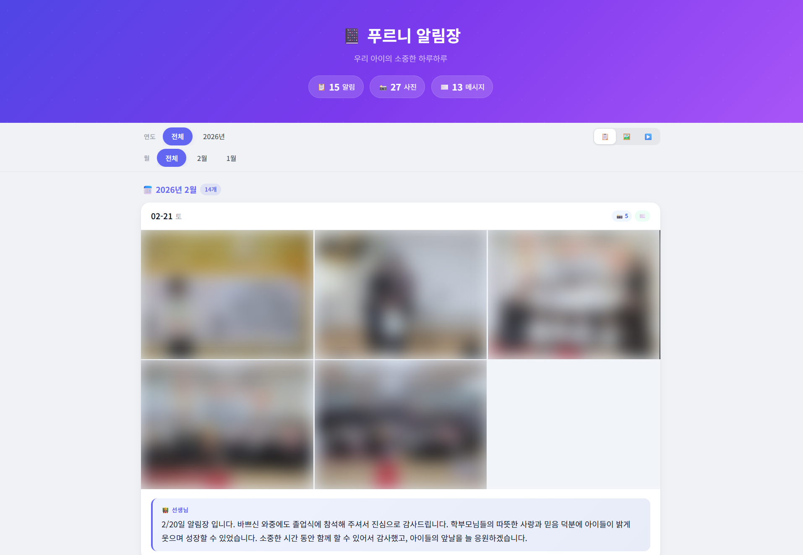
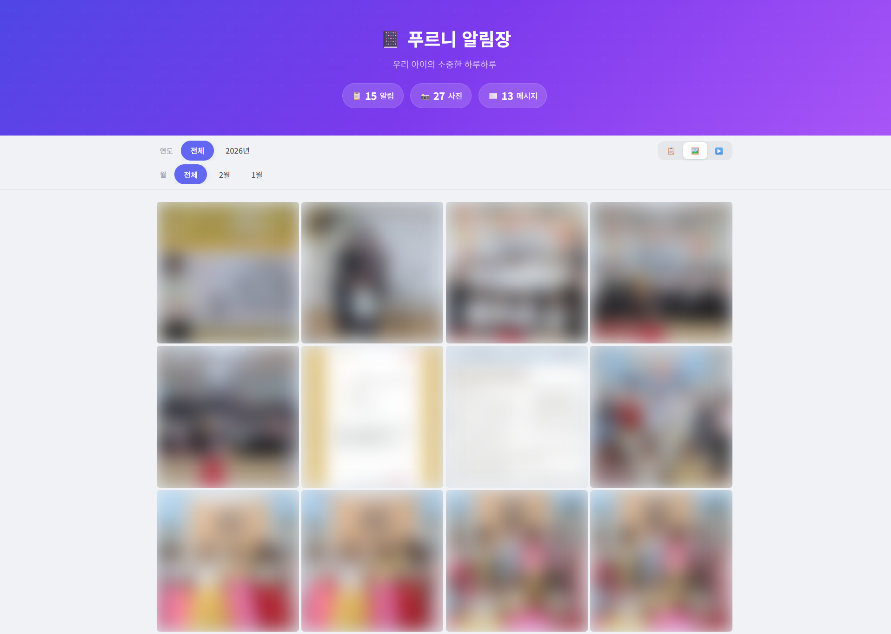
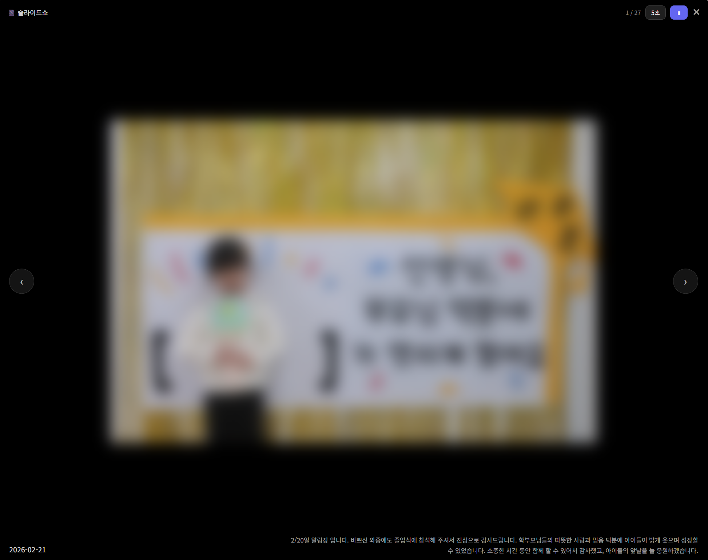

# 📔 푸르니 알림장 백업 도구

> 푸르니 어린이집 알림장의 **선생님 메시지**와 **사진**을 내 컴퓨터에 자동으로 저장하는 도구입니다.

졸업, 퇴소, 또는 서비스 종료 전에 우리 아이의 소중한 기록을 안전하게 백업하세요! 📸

---

## ✨ 주요 기능

- 🔐 자동 로그인 및 전체 페이지 탐색
- 📸 모든 사진 원본 다운로드
- ✉️ 선생님 메시지 텍스트 저장
- 📅 날짜별 폴더 자동 정리
- 🔍 실시간 메시지 검색 (특정 키워드 찾기)
- ❤️ 잘 나온 사진 즐겨찾기 (포토북 제작 준비)
- 🖼️ 예쁜 뷰어로 바로 확인 (타임라인 · 갤러리 · 슬라이드쇼)

---

## 🚀 사용 방법 (컴퓨터 초보자용 가이드)

### 📋 준비물

- **Windows 10 또는 11** 컴퓨터
- **푸르니 로그인 아이디/비밀번호** (www.puruni.com 에서 사용하는 것)
- **어린이집 코드** (아래에서 확인 방법 설명)
- **인터넷 연결**

#### 🏫 어린이집 코드 찾는 법

푸르니 알림장 주소를 보면 확인할 수 있습니다:

```
www.puruni.com/gmk   →  어린이집 코드 = gmk
www.puruni.com/abc   →  어린이집 코드 = abc
www.puruni.com/hello →  어린이집 코드 = hello
```

> 💡 모르겠으면 푸르니 알림장 페이지에 로그인한 후 브라우저 주소창에서 `www.puruni.com/` 뒤의 영문 이름을 확인하세요.

---

### 1단계: 이 프로그램 다운로드

1. 이 페이지 상단의 초록색 **`<> Code`** 버튼을 클릭합니다
2. **`Download ZIP`** 을 클릭합니다
3. 다운로드된 ZIP 파일을 **압축 해제**합니다
   - ZIP 파일을 우클릭 → `압축 풀기` 또는 `여기에 풀기`

> 💡 압축을 풀면 `puruni-downloader-main` 폴더가 생깁니다.

---

### 2단계: Node.js 설치 (처음 한 번만)

이 프로그램은 Node.js라는 도구가 필요합니다. 한 번만 설치하면 됩니다.

#### 방법 A: 자동 설치 (추천 👍)

1. 키보드에서 **Windows 키**를 누릅니다
2. **"PowerShell"** 을 검색합니다
3. **"Windows PowerShell"** 을 **우클릭** → **"관리자 권한으로 실행"** 클릭
4. 파란색 창이 뜨면 아래 글자를 **그대로** 복사해서 붙여넣기하고 Enter를 누릅니다:

```
winget install OpenJS.NodeJS.LTS
```

5. 설치가 끝나면 PowerShell 창을 닫습니다

#### 방법 B: 직접 다운로드

1. 웹 브라우저에서 [https://nodejs.org](https://nodejs.org) 에 접속합니다
2. **LTS** (왼쪽 초록 버튼)를 클릭하여 다운로드합니다
3. 다운로드된 파일을 실행하여 설치합니다
   - 설치 중 모든 옵션은 **기본값 그대로** 두고 `Next`를 계속 클릭하면 됩니다

> ⚠️ 설치 후 **컴퓨터를 재시작**하거나, 열려있는 명령 프롬프트를 닫았다 다시 열어야 합니다.

---

### 3단계: 실행하기!

1. 압축 푼 폴더로 들어갑니다
2. **`실행.bat`** 파일을 **더블클릭**합니다

> ⚠️ "Windows가 PC를 보호했습니다" 라는 파란 경고창이 뜰 수 있습니다.  
> → **"추가 정보"** 클릭 → **"실행"** 클릭하면 됩니다. (안전한 파일입니다)

3. 검은 창이 뜨면 안내에 따라 입력합니다:
   - **어린이집 코드** (URL에서 확인한 코드)
   - **아이디**
   - **비밀번호**
   - 반/아이가 여러 명이면 번호로 선택
4. 자동으로 다운로드가 시작됩니다!

> ⏱️ **전체 다운로드에 약 40~60분** 소요됩니다.  
> 그동안 컴퓨터를 사용해도 되지만, **검은 창은 닫지 마세요!**

---

### 4단계: 결과 확인

다운로드가 완료되면:

- 📁 `downloaded` 폴더에 날짜별로 사진과 메시지가 저장됩니다
- 🌐 **"뷰어를 열까요?"** 라고 물으면 `Y`를 입력하면 예쁜 뷰어가 열립니다

나중에 다시 보고 싶을 때는 **`뷰어.bat`** 파일을 더블클릭하면 됩니다.

---

## 📁 저장되는 파일 구조

```
downloaded/
├── 2024-03-15/
│   ├── 2024-03-15_message.txt        ← 선생님 메시지
│   ├── 2024-03-15_photo_01.jpg       ← 사진 1
│   ├── 2024-03-15_photo_02.jpg       ← 사진 2
│   └── 2024-03-15_parent_message.txt ← 가정 메시지 (있는 경우)
├── 2024-03-14/
│   └── ...
└── _backup_summary.json              ← 백업 요약 정보
```

> 💡 파일명에 날짜가 포함되어 있어서, 폴더 밖으로 꺼내도 언제 사진인지 알 수 있습니다.

---

## 🖼️ 뷰어 기능

`뷰어.bat`으로 실행하면 브라우저에서 예쁘게 볼 수 있습니다:

| 기능 | 설명 |
|------|------|
| 📋 **타임라인** | 날짜순으로 사진+메시지 카드 보기 |
| 🖼️ **갤러리** | 메시지 없이 사진만 격자로 보기 |
| ▶️ **슬라이드쇼** | 사진 자동 재생 (속도 조절 가능) |
| 📅 **연도/월 필터** | 특정 기간만 골라서 보기 |
| 🔍 **메시지 검색** | 실시간 키워드 검색 및 필터링 |
| ❤️ **즐겨찾기** | 베스트 컷 찜하기 및 모아보기 |
| 🔍 **확대 보기** | 사진 클릭하면 크게 보기, 키보드 ←→ |

### 📸 뷰어 미리보기

**타임라인 뷰** — 날짜별 사진 + 선생님 메시지



**갤러리 뷰** — 사진만 한눈에



**슬라이드쇼** — 자동 재생 + 메시지 오버레이



---

## ❓ 자주 묻는 질문 (FAQ)

### Q: Node.js가 뭔가요? 꼭 설치해야 하나요?

Node.js는 이 프로그램을 실행하기 위한 도구입니다. 한 번만 설치하면 되고, 다른 프로그램에 영향을 주지 않습니다.

### Q: 내 아이디/비밀번호가 어딘가에 저장되나요?

**아닙니다.** 입력한 아이디/비밀번호는 다운로드하는 동안만 사용되고, 어디에도 저장되지 않습니다.

### Q: "Windows가 PC를 보호했습니다" 경고가 떠요

이 프로그램은 안전합니다. "추가 정보" → "실행"을 클릭하면 됩니다. 인터넷에서 받은 .bat 파일을 처음 실행할 때 나오는 정상적인 경고입니다.

### Q: 다운로드 중에 오류가 발생했어요

- 아이디/비밀번호가 맞는지 확인해주세요
- 인터넷 연결을 확인해주세요
- `실행.bat`을 다시 실행하면 이어서 다운로드됩니다

### Q: 아이가 여러 반에 속해 있어요 / 아이가 여러 명이에요

걱정 마세요! 실행하면 자동으로 반 목록과 아이 목록이 표시되고, 번호만 입력하면 됩니다:

```
   🏫 반을 선택해주세요:
      1. 기린반
      2. 토끼반

   번호 입력: 1
   ✅ 기린반 선택됨
```

### Q: Mac에서도 사용할 수 있나요?

네! .bat 파일 대신 터미널에서 직접 실행하면 됩니다:

```bash
npm install
npx playwright install chromium
node scraper.js --id=아이디 --pw="비밀번호" --center=어린이집코드
node viewer.js
```

---

## 🛡️ 안전 및 개인정보

- 이 프로그램은 **오픈소스**입니다. 코드를 누구나 확인할 수 있습니다.
- 로그인 정보는 **어디에도 저장되지 않습니다.**
- 다운로드된 사진과 메시지는 **내 컴퓨터에만** 저장됩니다.
- 외부 서버로 데이터가 전송되지 않습니다.

---

## 📝 라이선스

MIT License - 자유롭게 사용, 수정, 배포할 수 있습니다.
